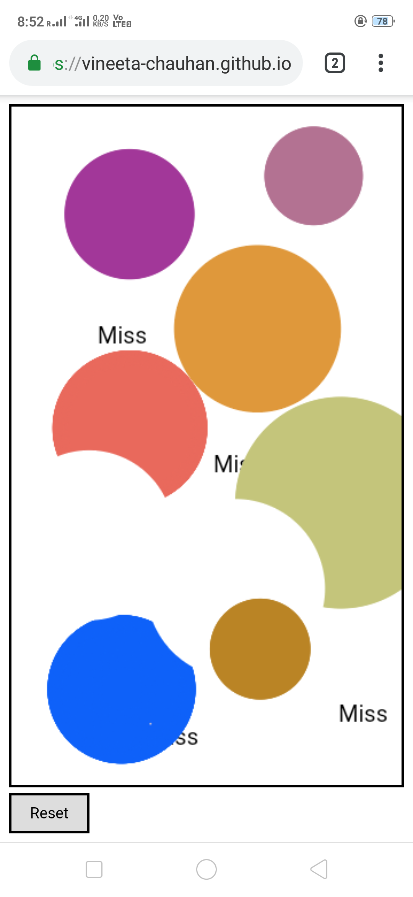

# vineeta-chauhan.github.io
## Module 1: ##
1. Create a Simple Paint App using HTML5 Canvas Element that lets users to draw circles on the canvas by clicking dragging the mouse - like in Windows Paint App. 
2. Size of circle should depend on how much the user drags the mouse. 
3. Automatically fill it with different color. 
4. Add a reset button that clears the canvas.

## Module 2: ##
1. Whenever you click on canvas show a text ‘Hit’ if there is a circle below the cursor else ‘Miss’.
2. Double clicking on a circle should delete the same.

## features
* This is responsive site
* This is in **HTML, CSS, vanila javaScript**
* you can create circles of diffrent readious by draging cursour in **PC**
* you can create circles of diffrent readious by touch and dag  in **MOBILE PHONE**
* If you will click or touch on existing Circle, It will display text **HIT**
* If you will click or touch on empty Canvash, It will dispay text **MISS**
* By double click on circles you will able to delete them in **PC or MOBILE both**
* By **long touch** on Circle in Mobile will going to delete circle
* **Rest** Button is their to reset the Canvash

## Desktop Look

## Mobile look

